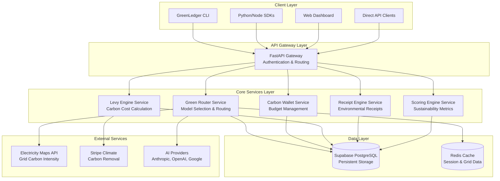

# GreenLedger Service Architecture

## Overview

GreenLedger is architected as a distributed system of loosely-coupled microservices, each responsible for a specific aspect of carbon-aware AI infrastructure. The system follows a layered architecture with clear separation of concerns.

## High-Level Architecture



## Service Definitions

### 1. API Gateway Service
**Location:** `apps/api/main.py`
**Responsibility:** Authentication, routing, rate limiting, API key management

**Key Components:**
- FastAPI application instance
- CORS middleware configuration
- Route registration for all services
- Firebase JWT authentication
- Health check endpoints

**Dependencies:**
- Firebase Auth for JWT verification
- All core service route modules

---

### 2. Green Router Service
**Location:** `apps/api/services/router.py` + `apps/api/routes/infer.py`
**Responsibility:** Intelligent model and region selection based on carbon efficiency

**Key Functions:**
- Real-time grid carbon intensity lookup
- Model efficiency benchmarking
- Multi-criteria optimization (carbon, cost, latency, quality)
- Regional compute selection

**Data Dependencies:**
- Grid carbon intensity (Electricity Maps API)
- Model benchmark data (internal)
- Provider availability by region

**API Endpoints:**
```
POST /v1/route         - Get optimal model/region recommendation
POST /v1/infer         - Execute inference with routing
```

---

### 3. Carbon Wallet Service
**Location:** `apps/api/services/wallet.py` + `apps/api/routes/wallets.py`
**Responsibility:** Carbon budget management and enforcement

**Key Functions:**
- Budget allocation and tracking
- Real-time spend monitoring
- Policy enforcement (block/downgrade/defer/offset)
- Transaction logging

**Database Tables:**
- `carbon_wallets` - Budget definitions
- `wallet_transactions` - Spend history

**API Endpoints:**
```
POST   /v1/wallets                    - Create wallet
GET    /v1/wallets/:agent_id          - Get wallet status
PATCH  /v1/wallets/:agent_id          - Update budget/policy
GET    /v1/wallets/:agent_id/history  - Transaction history
POST   /v1/wallets/:agent_id/offset   - Purchase offsets
```

---

### 4. Levy Engine Service
**Location:** `apps/api/services/levy.py` + `apps/api/routes/pay.py`
**Responsibility:** Carbon cost calculation and automated levy routing

**Key Functions:**
- Carbon footprint calculation
- Dynamic carbon pricing
- Payment integration with Stripe Climate
- Pooled fund management for small transactions

**Integration Points:**
- Stripe Climate Orders API
- Custom carbon removal partners
- Payment rail integration (Stripe, x402, AP2)

**API Endpoints:**
```
POST /v1/pay           - Execute payment with carbon levy
GET  /v1/levy/status   - Check levy transaction status
```

---

### 5. Receipt Engine Service
**Location:** `apps/api/services/receipt.py` + `apps/api/routes/receipts.py`
**Responsibility:** Standardized environmental impact documentation

**Key Functions:**
- Receipt generation for every AI action
- Environmental impact calculation
- Comparative analysis (vs naive approach)
- Export capabilities (CSV, JSON)

**Database Tables:**
- `receipts` - All environmental receipts

**API Endpoints:**
```
GET  /v1/receipts/:receipt_id          - Single receipt
GET  /v1/receipts                      - List with filters
GET  /v1/receipts/export               - Bulk export
```

---

### 6. Scoring Engine Service
**Location:** `apps/api/services/scoring.py` + `apps/api/routes/scores.py`
**Responsibility:** Sustainability score computation and benchmarking

**Key Functions:**
- Multi-dimensional scoring algorithm
- Trend analysis and improvement tracking
- Industry benchmarking
- Optimization recommendations

**Database Tables:**
- `sustainability_scores` - Historical scores
- `recommendations` - Optimization suggestions

**API Endpoints:**
```
GET /v1/scores/:org_id                     - Org-level score
GET /v1/scores/:org_id/agents              - Agent scores
GET /v1/scores/:org_id/benchmarks          - Industry comparison
GET /v1/scores/:org_id/recommendations     - Suggestions
```

## Data Architecture

### Database Schema Overview
```sql
-- Core entities
organizations          -- Company accounts
api_keys              -- Authentication
agents                -- Registered AI agents

-- Green Router
grid_carbon_intensity  -- Real-time grid data
model_benchmarks      -- Energy efficiency per model
routing_decisions     -- Decision audit log

-- Carbon Wallets
carbon_wallets        -- Budget definitions
wallet_transactions   -- Spend/credit history

-- Environmental Tracking
receipts              -- Every AI action receipt
levy_transactions     -- Carbon levy payments

-- Analytics
sustainability_scores -- Computed metrics
recommendations      -- Optimization suggestions
```

### Caching Strategy
**Redis Cache Usage:**
- Grid carbon intensity (5-minute TTL)
- Model benchmark data (24-hour TTL)
- Route optimization results (1-hour TTL)
- Session data and API rate limiting

## External Service Integration

### 1. Electricity Maps Integration
**Purpose:** Real-time grid carbon intensity data
**Polling:** Every 5 minutes for active regions
**Fallback:** Static EPA/IEA regional averages
**Cache:** Redis with 5-minute TTL

### 2. Stripe Climate Integration
**Purpose:** Automated carbon removal purchasing
**Method:** Orders API for verified carbon removal
**Batching:** Hourly aggregation of micro-levies
**Minimum:** $1 USD order threshold

### 3. AI Provider Integration
**Supported:** Anthropic, OpenAI, Google Gemini
**Wrapper:** Unified interface with energy metering
**Security:** Customer API keys, not stored centrally

## Security & Compliance

### Authentication & Authorization
- Firebase JWT for user sessions
- API key authentication for service-to-service
- Organization-level resource isolation
- Supabase Row Level Security (RLS)

### Data Protection
- All API keys encrypted at rest
- Receipt data org-isolated
- No AI provider keys stored in GreenLedger
- PCI compliance via Stripe for payments

### Audit Trail
- Complete routing decision logging
- All wallet transactions tracked
- Receipt generation for every action
- Carbon levy payment verification

## Deployment Architecture

### Current Structure
```
apps/
├── api/           # FastAPI backend services
├── web/           # Next.js frontend dashboard
└── cli/           # Interactive CLI interface

docs/              # Architecture documentation
tests/             # Comprehensive test suite
```

### Service Dependencies
1. **Database:** Supabase (PostgreSQL + Auth)
2. **Cache:** Redis for session and grid data
3. **External APIs:** Electricity Maps, Stripe Climate
4. **AI Providers:** Customer-provided API keys

### Background Jobs
- **Grid Refresh:** Poll Electricity Maps every 5 minutes
- **Levy Batch:** Process accumulated levies hourly
- **Score Compute:** Daily sustainability score calculation
- **Benchmark Update:** Weekly model efficiency updates

## Development & Testing

### Testing Strategy
- Unit tests for each service component
- Integration tests for external API interactions
- End-to-end tests for complete workflows
- Mock data for development and testing

### API Documentation
- OpenAPI/Swagger documentation auto-generated
- Interactive API explorer at `/docs`
- Comprehensive endpoint examples
- Client SDK generation support

## Performance & Scalability

### Caching Strategy
- Redis for frequently accessed data
- Database connection pooling
- Query optimization with appropriate indexes
- CDN for static dashboard assets

### Monitoring & Observability
- Health check endpoints for all services
- Request/response logging
- Error tracking and alerting
- Performance metrics collection

---

*This service architecture supports GreenLedger's mission to provide carbon-aware infrastructure for the agentic AI economy while maintaining scalability, security, and developer experience.*